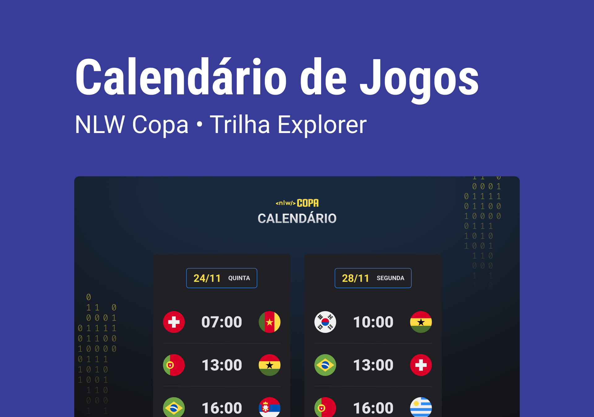

<h1 align="center"> NLW COPA DO MUNDO 2022</h1>

Evento exclusivo e gratuito, promovido pela Rocketseat para ensino de tecnologias WEB.

  <a href="#-tecnologias">Tecnologias</a>&nbsp;&nbsp;&nbsp;|&nbsp;&nbsp;&nbsp;
  <a href="#-projeto">Projeto</a>&nbsp;&nbsp;&nbsp;|&nbsp;&nbsp;&nbsp;
  <a href="#-layout">Layout</a>&nbsp;&nbsp;&nbsp;|&nbsp;&nbsp;&nbsp;
  <a href="#memo-licença">Licença</a>

  

 

  

## 🚀 Tecnologias

Esse projeto foi desenvolvido com as seguintes tecnologias:

- HTML e CSS
- JavaScript
- Git & Github

## 💻 Projeto

O Calendário da Copa é um projeto que mostra os jogos da nossa Seleção Brasileira na fase de grupos da Copa do Mundo no Qatar 2022.

## 🔖 Layout

Você pode visualizar o layout do projeto através [DESSE LINK](https://www.figma.com/file/gFF1wsoeKmx1RmTyflepFw/Calend%C3%A1rio-de-Jogos-(Community)?node-id=301%3A1812/duplicate). É necessário ter conta no [Figma](https://figma.com) para acessá-lo.

## :memo: Licença

Esse projeto está sob a licença MIT.

---

Feito com ♥ by Natã Pires :wave: [Entre em contato pelo Linkedln](https://www.linkedin.com/in/nat%C3%A3-pires-ferreira-7062281a0/)
